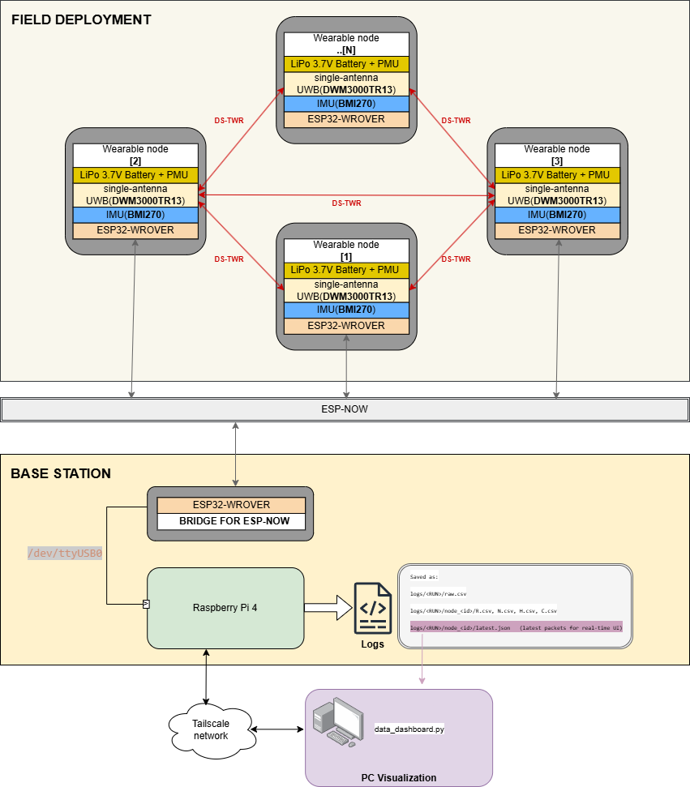
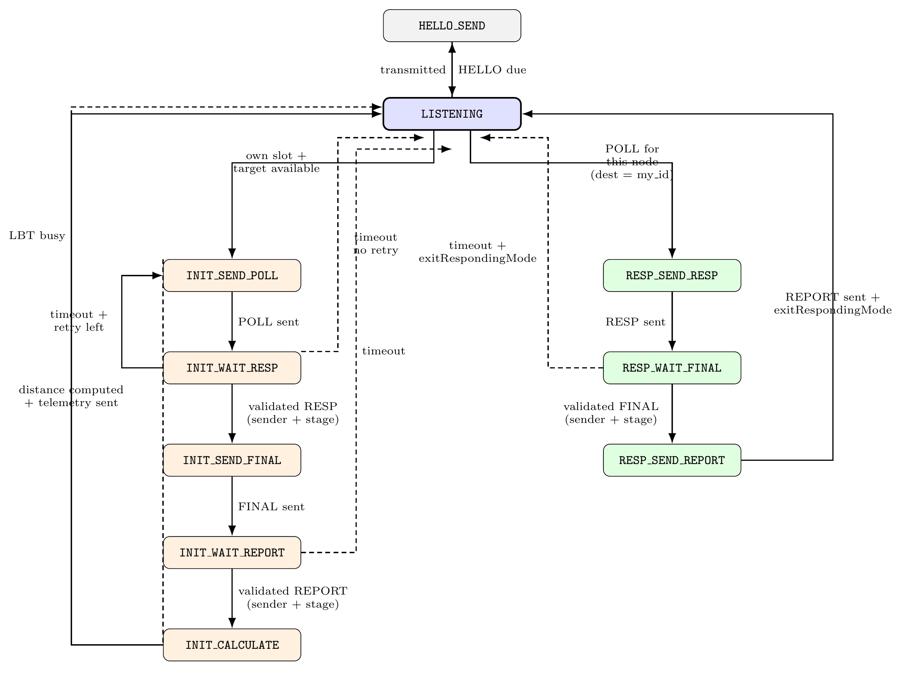

# Decentralised Social Network Analysis of Dairy Cattle
## P2P UWB Mesh + IMU-Based Behaviour Classification

Firmware for the wearable sensor system developed as part of the Master's thesis:  
**"Decentralised Social Network Analysis of Dairy Cattle Using Peer-to-Peer UWB Ranging and IMU-Based Behaviour Classification"**  
Vishwanath Kaleeswaran — Eindhoven University of Technology, March 2026

---

## Overview

This repository contains the embedded firmware for a collar-mounted wearable sensor node designed to monitor dairy cattle social behaviour without any fixed barn infrastructure. Each node integrates:

- **Peer-to-peer UWB ranging** (Qorvo DW3000) — measures pairwise inter-animal distances directly via DS-TWR, no anchors required
- **IMU-based behaviour classification** (Bosch BMI270) — classifies walking, grazing, resting, and miscellaneous behaviours on-device using a Decision Tree (F1 = 0.93)
- **ESP-NOW telemetry** — transmits ranging and classification results to a portable base station

The key design constraint is that the IMU and UWB subsystems share the same ESP32 and must run concurrently without interfering. IMU sampling is gated to the `LISTENING` state only, so I2C activity never overlaps with the DW3000 SPI timestamp capture during an active DS-TWR exchange.

The field trial was conducted at Hoeve Boveneind, a commercial dairy farm in the Netherlands, using 10 collar-mounted nodes on Holstein-Friesian cows. 

Alternatively, the PCB, and the firmware could be used for any kind of peer to peer UWB configuration applications.
---

## System Architecture



---

## Hardware

| Component | Part | Interface | Role |
|-----------|------|-----------|------|
| MCU | ESP32-WROVER-IE-N4R8 | — | Central processor, ESP-NOW telemetry |
| UWB | DWM3000TR13 (Qorvo) | SPI | DS-TWR ranging, Ch. 5, 6.8 Mbps |
| IMU | BMI270 (Bosch) | I2C | 6-axis accel/gyro, behaviour classification |
| USB-UART | CP2104 (Silicon Labs) | USB-C | Firmware upload, serial debug |
| Battery | LiPo 3.7V 2500mAh | — | ~8h continuous operation |

PCB: 4-layer, 82 × 56 mm, designed in Altium Designer. Full schematics in `hardware/`.
In the manufactured PCB, the LEDs seems to be placed in the wrong direction, but other than that overall functionality is intact.

**Pin mapping (defined in `include/peer_config.h`):**

```
PIN_RST  = 27   DW3000 hard reset
PIN_CS   = 4    SPI chip select
PIN_IRQ  = 34   DW3000 frame-event interrupt (input only)
PIN_SCK  = 18   SPI clock
PIN_MISO = 19   SPI MISO
PIN_MOSI = 23   SPI MOSI
IMU_SDA  = 21   I2C data
IMU_SCL  = 22   I2C clock
```

---

## Firmware Structure

```
P2P-mesh-IMU/
├── src/
│   ├── main.cpp              # Main loop, state machine, IMU sampling, classification
│   ├── espnow_sender.cpp     # ESP-NOW packet formatting and transmission
│   ├── neighbor_table.cpp    # Neighbour discovery, distance filtering, target selection
│   ├── tdma_scheduler.cpp    # TDMA frame timing and slot management
│   └── range_logger.cpp      # Circular buffer for ranging log entries
├── include/
│   ├── peer_config.h         # All system-wide constants (single source of truth)
│   ├── cattle_classifier.h   # Decision Tree classifier + LR fallback (header-only)
│   ├── espnow_sender.h
│   ├── neighbor_table.h
│   ├── tdma_scheduler.h
│   ├── range_logger.h
│   └── wifi_udp_sender.h     # WiFi UDP alternative to ESP-NOW (WIFI_ENABLED=0)
├── lib/
│   └── DW3000/               # DW3000 SPI driver (DW3000.h / DW3000.cpp)
├── base_station/
│   └── src/main.cpp          # ESP32 base station firmware (ESP-NOW → Serial bridge)
├── raspberry_pi/
│   └── mesh_logger.py        # Pi-side logger (serial → per-node CSV files)
├── pc_client/
│   └── mesh_client.py        # PC visualiser (TCP → MDS relative positioning)
└── test/
    ├── aggregator.py          # Multi-base-station data aggregator
    └── mesh_localizer.py      # Standalone MDS localiser
```

---

## Node Identity — Auto-Addressing

Every node derives its `TAG_ID` from its factory MAC address using FNV-1a hashing. No manual configuration is needed — flash the same binary to all nodes and they self-assign:

```cpp
uint32_t hash = 2166136261;          // FNV offset basis
for (int i = 0; i < 6; i++) {
    hash ^= (mac >> (i * 8)) & 0xFF; // XOR each MAC byte
    hash *= 16777619;                 // FNV prime
}
TAG_ID = (hash % 253) + 1;           // Maps to [1, 253]
```

The TDMA slot follows automatically: `slot = TAG_ID % NUM_SLOTS`. Since `NUM_SLOTS = 23` is prime, hash collisions are minimised. For bench testing, override via build flags: `-DTAG_ID_OVERRIDE=54`.

---

## TDMA Scheduling

The UWB channel is divided into 23 time slots of 25 ms each, giving a frame period of 575 ms. Each node initiates ranging only in its own slot but listens and responds in any slot. This means the system is fully self-organising — no coordinator, no clock synchronisation required.

```
|  0  |  1  |  2  | ... |  *  | ... | 22  |   frame = 575ms
                          ↑
                      my slot (TAG_ID % 23)
```

`RANGE_EVERY_N_FRAMES = 2` means a node initiates ranging every second frame, halving the TX duty cycle while maintaining full responsiveness as a responder.

When a node receives a HELLO from a node with a lower TAG_ID, it adjusts its own frame start time to loosely synchronise. This reduces inter-slot interference without needing a dedicated sync master (`SYNC_TO_LOWER_ID = 1`, `SYNC_HOLDOFF_MS = 5000`).

---

## DS-TWR Ranging

Distance is measured using Double-Sided Two-Way Ranging. Four messages are exchanged — POLL, RESP, FINAL, REPORT — and both nodes record their own send/receive timestamps. The symmetric Decawave APS013 formula is then applied:

```
ToF = (T_roundA × T_roundB − T_replyA × T_replyB)
      ─────────────────────────────────────────────
      (T_roundA + T_roundB + T_replyA + T_replyB)
```

This formula is symmetric: swapping A↔B gives identical results, so both nodes report the same distance. `int64_t` intermediates are used to prevent overflow. The original firmware had a bug where the clock offset sign was conditionally flipped based on which reply time was larger — this was replaced with the correct symmetric formula.

### UWB State Machine

The firmware uses a cooperative state machine. Every state handler checks its condition and returns immediately if not ready — nothing blocks the loop.



**Initiator path (orange):**
1. `INIT_SEND_POLL` — sends POLL, records `tx_poll`
2. `INIT_WAIT_RESP` — waits for RESP, records `rx_resp`, computes `t_round_a`
3. `INIT_SEND_FINAL` — sends FINAL, records `tx_final`, computes `t_reply_a`
4. `INIT_WAIT_REPORT` — receives REPORT containing `t_round_b` and `t_reply_b` from responder
5. `INIT_CALCULATE` — plugs all four values into the DS-TWR formula, converts to cm, sends R packet

**Responder path (green):**
1. `RESP_SEND_RESP` — sends RESP, records `tx_resp`, computes `t_reply_b`
2. `RESP_WAIT_FINAL` — waits for FINAL, records `rx_final`, computes `t_round_b`
3. `RESP_SEND_REPORT` — sends REPORT containing `t_round_b` and `t_reply_b`, exits responding mode

Dashed arrows indicate timeout transitions back to `LISTENING`. All wait states validate `mode`, `sender_id`, and `stage` before advancing — stray frames cannot corrupt an ongoing exchange.

### Collision Mitigation

Two mechanisms on top of TDMA:

1. **Listen-Before-Talk (LBT)** — before sending POLL, listen for 5 ms. If the channel is active, back off 10–50 ms and retry up to 3 times.
2. **Random jitter** — add 0–8 ms random delay before each transmission. Nodes that share a TDMA slot due to a hash collision will not always fire at exactly the same time.

---

## IMU Behaviour Classification

The classifier runs entirely on the ESP32 — no cloud dependency. It uses a Decision Tree (depth 10, 163 leaves) trained on the WASP-lab public dataset (Morales-Vargas et al. 2025), achieving a macro F1-score of 0.93 on the training data.

**Pipeline (runs every 2.5 s):**

1. Collect 50 samples at 10 Hz (5 s window, 50% overlap) from BMI270
2. Extract 112 statistical and spectral features from 8 signals (ax, ay, az, |a|, gx, gy, gz, |g|)
3. Select 60 features using a pre-computed index array
4. Normalise using stored StandardScaler parameters (subtract mean, divide by std)
5. Classify with Decision Tree → raw prediction
6. Majority vote over last 3 predictions → smoothed output

**Behaviour labels:**

| Code | Label | Description |
|------|-------|-------------|
| 0 | Walking | Locomotion |
| 1 | Grazing | Head-down feeding motion |
| 2 | Resting | Lying or standing still |
| 3 | Misc | Drinking, licking, head-bobbing, transitions |

**Critical design constraint:** `sampleIMU()` is called only when `state == NodeState::LISTENING`. I2C bus activity during an active DS-TWR exchange would corrupt the DW3000 SPI timestamps. This single guard is what makes concurrent ranging and classification possible on a single cooperative loop.

A logistic regression model (F1 = 0.92) is available as a fallback in `cattle_classifier.h`. Both models are stored as static `const` arrays in flash — no heap allocation at inference time.

---

## Telemetry Packet Formats

All packets are transmitted as compact CSV strings via ESP-NOW. The base station prepends a wall-clock timestamp before writing to disk.

**From node → base station (ESP-NOW):**

| Type | Format | Sent when |
|------|--------|-----------|
| R (Range) | `R,<from>,<to>,<dist_cm>,<rssi>,<node_ts>` | After each successful DS-TWR |
| C (Classify) | `C,<node>,<behav>,<conf>,<ax>,<ay>,<az>,<gx>,<gy>,<gz>,<node_ts>,<range_age_ms>,<nbrs>,<range_pct>` | Every 2.5 s |
| H (Heartbeat) | `H,<node>,<frame>,<nbr_count>,<uptime_ms>` | Every 5 s |
| N (Neighbour) | `N,<node>,<nbr>,<hellos>,<range_pct>,<dist>,<rssi>,<stale>,<stale_ms>` | Every 5 s per neighbour |

**C packet staleness fields** — the base station can determine whether the IMU classification is associated with current ranging data:
- `range_age_ms` — ms since this node's last successful DS-TWR exchange
- `nbrs` — number of active neighbours at time of classification
- `range_pct` — overall ranging success rate (0–100)

**From base station → Raspberry Pi (Serial, 921600 baud):**
```
rx_ms, station_id, src_mac, TYPE, fields...
```

---

## Timing Budget

Nothing blocks the UWB state machine. Every task is cooperative and time-bounded:

| Task | When | Duration | UWB impact |
|------|------|----------|------------|
| IMU read | Every 100 ms, LISTENING only | ~0.3 ms I2C | None |
| Classification | Every 2.5 s (50% overlap) | ~2 ms compute | None |
| ESP-NOW send | After classify / after range | ~0.5 ms | Non-blocking |
| DS-TWR exchange | TDMA-scheduled, ~575 ms frame | ~20 ms | Normal operation |

---

## Neighbour Management

Nodes discover each other via HELLO beacons broadcast every 3 s (with up to 500 ms random jitter to prevent broadcast storms). A node is only added to the neighbour table after **2 consecutive HELLOs** — this prevents false entries from stray packets during startup. A neighbour is removed after **15 s of silence** (5 missed beacons), which is intentionally conservative: re-establishing a neighbour costs at least 6 s during which ranging opportunities are lost.

**Ranging target selection** (`RANGE_ALL_NEIGHBORS = 1`):
1. Stale long-range links first — these are likely bridge edges whose removal could disconnect the mesh
2. Any other stale links
3. Round-robin through remaining active neighbours

Distance filtering per link: hard reject (< 10 cm or > 3000 cm) → outlier reject (jump > 200 cm) → rolling median over 7 samples → EMA (α = 0.3).

---

## Build and Flash

Requires [PlatformIO](https://platformio.org/).

```bash
# Node firmware — development build (serial debug ON)
cd P2P-mesh-IMU
pio run -e node
pio run -e node --target upload

# Node firmware — field deployment (serial OFF, ~2mA saving)
pio run -e production
pio run -e production --target upload

# Base station firmware
cd base_station
pio run
pio run --target upload
```

Override TAG_ID for bench testing:
```ini
; in platformio.ini
build_flags = -DTAG_ID_OVERRIDE=54
```

---

## Raspberry Pi Logger

```bash
# Install dependency
pip3 install pyserial

# Run logger (serial mode)
python3 raspberry_pi/mesh_logger.py --mode serial --port /dev/ttyUSB0

# Run logger (UDP mode, if base station has WiFi enabled)
python3 raspberry_pi/mesh_logger.py --mode udp --bind_port 5005
```

Logs are written to `logs/<RUN>/`:
- `raw.csv` — every packet with wall-clock timestamp
- `node_<id>/R.csv`, `N.csv`, `H.csv`, `C.csv` — per-type per-node logs
- `node_<id>/latest.json` — most recent packet of each type (for real-time UI)

---

## Known Limitations

- **Classifier domain shift** — the Decision Tree was trained on open-pasture data (Morales-Vargas et al. 2025, Maquehue Farm, Chile). Field deployment in an indoor barn produced an elevated Miscellaneous rate (~36% herd average). On-site retraining with 2–4 hours of video-annotated data is recommended before long-term deployment.
- **ESP-NOW range** — peripheral nodes beyond ~30–50 m from the base station may successfully perform UWB peer-to-peer ranging but fail to deliver classification packets to the base station. Adding a second base station at the opposite barn end resolves this.
- **Single antenna** — the DWM3000TR13 module has a single antenna. Collar orientation changes (e.g., cow lowering head to eat) affect the UWB signal path and introduce ranging error. Per-node antenna delay calibration would reduce systematic bias.
- **Battery life** — the current prototype runs ~8 h on a 2500 mAh LiPo. Multi-day deployment requires more aggressive duty-cycling of the ranging and telemetry subsystems.

---